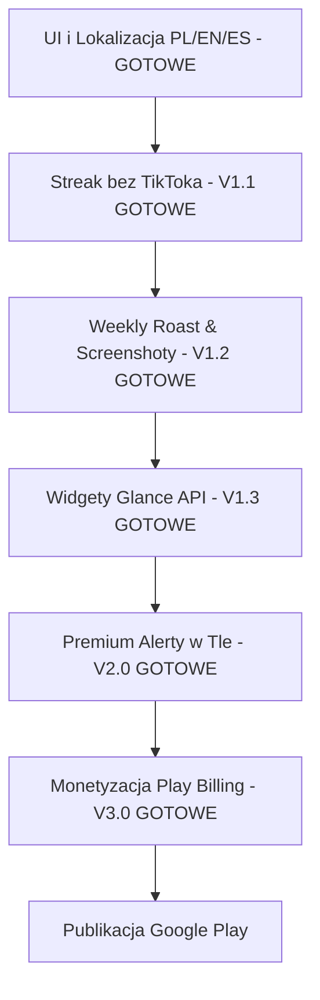

# Raport Zmian i Rozwoju — ScrollDebt

Ten plik zawiera zestawienie wprowadzonych zmian, naprawionych elementów interfejsu oraz kierunków dalszego rozwoju aplikacji **ScrollDebt**.

---

## [Unreleased]

### Added

- **Testy instrumentowane (Android Instrumented Tests):** Dodano test `TimeFormatUtilsTest.kt` w katalogu `app/src/androidTest`, weryfikujący poprawność działania i niepusty wynik funkcji formatowania czasu w kontekście aplikacji Android.
- **Strona WWW & Polityka Prywatności:** Utworzono i opublikowano oficjalny landing page aplikacji na darmowym hostingu GitHub Pages. Strona zawiera wielojęzyczną politykę prywatności (wymaganą przez Google Play), interaktywny changelog oraz opis głównych funkcji. Zintegrowano natywne wsparcie dla 5 języków (EN, PL, ES, FR, DE).
- **Zgodność Pasków Systemowych z Motywem:** Naprawiono błąd niewidocznych ikon na pasku stanu i nawigacji (godzina, bateria). Od teraz aplikacja dynamicznie w locie zmienia kolor ikon systemowych na odpowiedni (jasny/ciemny), gdy użytkownik nadpisze globalny motyw systemu za pomocą wewnętrznych ustawień aplikacji.
- **Naprawa drgania BottomSheet (Jitter Bug):** Rozwiązano problem nieskończonego zapętlania układu ekranu (overscroll thrashing) w oknie "Dodaj inną aplikację" na ekranie ustawień. Przechwycono zdarzenia `nestedScroll` pochodzące z długich list (LazyColumn), co całkowicie wyeliminowało drgania interfejsu występujące przy szybkim przewijaniu do dołu.
- **Inteligentny Formater Czasu (TimeFormatUtils):** Wdrożono dynamiczne, hierarchiczne formatowanie bardzo dużych wartości czasu (dni, miesiące, lata). Zabezpiecza to interfejs użytkownika przed ucinaniem tekstu przy wyświetlaniu np. kilkudziesięciu tysięcy "Straconych" godzin. Dodano pełną lokalizację skrótów z obsługą liczby mnogiej (np. polskie "1r" / "2l").
- **Motyw Jasny / Ciemny (Theme Support):** Dodano możliwość wyboru motywu aplikacji z poziomu ustawień. Przełączanie motywu odbywa się natychmiast dzięki synchronizacji stanu w `MainScreenViewModel`, bez potrzeby restartu aplikacji.
- **Język Niemiecki (DE) — Pełna Lokalizacja:** Dodano kompletne tłumaczenie interfejsu na język niemiecki, w tym ekran Premium, ekran Onboarding, komunikaty Brutal Truth (Short/Medium/Long, AppSpecific oraz Weekly Roasts — 5 poziomów). Waluta ustawiona na Euro (€), stawka godzinowa 12€.
- **Automatyczne wykrywanie języka DE:** `PreferencesManager.getDefaultLanguage()` rozpoznaje język systemowy `de` i automatycznie ustawia niemiecki przy pierwszym uruchomieniu.

### Changed

- **Optymalizacja zużycia pamięci przy generowaniu grafik (Canvas scale):** W `ShareUtils.generateRoastBitmap()` wprowadzono przeskalowanie płótna (Canvas) o współczynnik 0.5x, co zmniejszyło zapotrzebowanie na pamięć RAM o 75% przy zachowaniu poprawnych proporcji i jakości udostępnianej grafiki (Weekly Roast).
- **Ułatwienia dostępu (Accessibility Semantics):** Dodano brakujące opisy `contentDescription` dla suwaków i przełączników na ekranie `SettingsScreen.kt` w celu poprawy wsparcia czytników ekranu (TalkBack).
- **Zabezpieczenie Suwaków (UX):** Dodano 16dp poziomego marginesu (padding) do suwaków na ekranie Ustawień. Zapobiega to przypadkowemu wyzwalaniu systemowego gestu "Wstecz" (Edge-to-edge swipe) podczas próby zmiany wartości progów czasowych.
- **Przeprojektowanie ekranu Ustawień (Premium UI):** Sekcja wyboru motywu ("Wygląd") została przeniesiona na sam dół ekranu, ustępując miejsca kluczowym funkcjom (Śledzone aplikacje, progi powiadomień). Masywne przyciski zastąpiono subtelnym przełącznikiem kafelkowym z emoji ☀️/🌙.
- **Kolejność Języków w Menu:** Uporządkowano listę wyboru języka według globalnej liczby użytkowników: EN → ES → FR → DE → PL (zamiast dotychczasowej PL → EN → ES → FR).

### Fixed

- **Krytyczny błąd responsywności (Strona WWW na Mobile):** Naprawiono ukryte przepełnienie kontenera układu, które spychało główną treść strony i ucinało elementy (`features-grid`, nagłówki) uciekające poza ekran. Błąd ten wynikał z klasycznego problemu z Flexboxem (`min-width: auto`), w którym domyślne zachowanie potomków uniemożliwia im skurczenie się poniżej naturalnej wielkości ich dzieci (w tym przypadku potężnej `.gallery-scroll`). Naprawa została przeprowadzona za pomocą "złotej kuli" (`min-width: 0`), zastosowanej konsekwentnie we wszystkich głównych sekcjach używających układów elastycznych (`<main>`, `.hero-content`, `.features-grid`, `.gallery-wrapper`).
- **Lokalizacja przełącznika motywu:** Dodano brakujące klucze tłumaczeń (`appearance_title`, `theme_light`, `theme_dark`) we wszystkich 5 językach (PL/EN/ES/FR/DE). Naprawiono regresję, w której użytkownik z innym językiem widział polskie etykiety.
- **Martwe importy w Theme.kt:** Usunięto 5 nieużywanych importów pozostałych po usunięciu trybu "System" (m.in. `isSystemInDarkTheme`, `dynamicDarkColorScheme`).
- **Czyszczenie motywów (Theme cleanup):** Usunięto nieużywaną i zduplikowaną wartość koloru `WarningRed` z pliku `Theme.kt`, upraszczając konfigurację kolorystyczną.
- **Brakujące tłumaczenia powiadomienia Foreground Service:** Naprawiono `DoomTrackerService.buildForegroundNotification()` — tekst powiadomienia "Monitoring screen time..." brakowało dla języków FR i DE. Zastąpiono łańcuch `if/else` czytelnym `when` pokrywającym wszystkie 5 języków.
- **Customowa ikona powiadomień:** Zastąpiono systemową ikonę Androida własną, minimalistyczną klepsydrą (`ic_hourglass_notification`) dla powiadomień Foreground Service oraz alertów ostrzegawczych.
- **Lokalizacja Share Intent:** Zastąpiono twardo zakodowany tekst "Pobierz ScrollDebt..." w module udostępniania (`ShareUtils.kt`) poprawnym tłumaczeniem dla wszystkich 5 języków.
- **Testy jednostkowe (Unit Tests):** Dodano testy dla klasy `BrutalTruthEngine.kt` w katalogu `test/`, weryfikując generowanie roastów i fallback językowy.

### Removed

- Usunięto opcję "System" z wyboru motywu na rzecz prostszego wyboru Jasny/Ciemny.
- Usunięto przestarzałe i nieużywane zrzuty ekranu (screen_2.png, screen_3.png, screen_light_4.png, screen_today_de.png) z repozytorium Git strony internetowej w celu uporządkowania i odchudzenia projektu.
- Usunięto przestarzałe, lokalne pliki z folderu aplikacji Android (screenshot_premium.png, migrate_strings.py, refactor_localization.py).

---

## [3.0.0] - 2026-05-27

### Added

- **Monetyzacja Google Play Billing (Freemium):** Wdrożenie pełnego systemu mikropłatności. Aplikacja oferuje jednorazowy zakup odblokowujący funkcje Premium na zawsze (Lifetime PRO).
- **Ekran Premium (Paywall):** Stworzono konwertujący, mroczny ekran zachęcający do zakupu funkcji PRO z animowanymi elementami (np. odbijający się diament) oraz systemem przywracania zakupów dla powracających użytkowników.
- **Blokada Funkcji Premium:** Zablokowano "Tryb Snajperski" (śledzenie w czasie rzeczywistym) oraz opcję dodawania niestandardowych aplikacji za kłódkami (🔒), czyniąc z nich główną wartość wersji PRO.
- **Prominent Disclosure (Zgodność z Google Play):** Wdrożono rygorystyczne wymagania polityki prywatności Google. Ekran powitalny wymusza teraz na użytkowniku aktywne zaznaczenie Checkboxa (Affirmative User Action) potwierdzającego zrozumienie celu zbierania danych statystycznych (Usage Data) przed umożliwieniem nadania uprawnień.
- **Developer Backdoor:** Dodano bezpieczny (ukryty za `BuildConfig.DEBUG`), siedmiokrotny klik w diament na ekranie Premium, pozwalający deweloperom i testerom błyskawicznie odblokować funkcje PRO na symulatorze bez dokonywania prawdziwej płatności.

### Changed

- Domyślny tryb śledzenia dla nowych instalacji został zmieniony na `BATTERY_SAVER` (Oszczędny), aby zapobiec omijaniu paywalla przez nowych, darmowych użytkowników.
- Tryb Snajperski przeniósł się oficjalnie do puli funkcji Premium.

---

## [1.3.0] - 2026-05-26

### Added

- **Język Francuski (FR):** Pełne tłumaczenie interfejsu oraz kompletna baza bezlitosnych powiadomień "Brutal Truth" w języku francuskim, aby uderzać w sumienie użytkowników z jeszcze większym globalnym zasięgiem.
- **Inteligentne Hybrydowe Śledzenie (V2.0):** Potężna nowa architektura monitorowania czasu w tle. Użytkownik ma teraz w ustawieniach opcję wyboru pomiędzy:
  - **Tryb Snajperski (Na żywo):** Uruchamia systemowy Foreground Service odpytujący czas użycia niemal co do sekundy. Gwarantuje dostarczenie bolesnego powiadomienia (Roastu) bez najmniejszego opóźnienia, kosztem obecności małej ikony na pasku.
  - **Tryb Oszczędny:** Polega na tradycyjnym systemie uśpienia (WorkManager), wysyłając ostrzeżenie gdy tylko system operacyjny na to pozwoli. Oszczędza każdą kroplę baterii.
- **Uprawnienia powiadomień Push:** Zgodność z najnowszym API Androida 13+, gdzie aplikacja prawidłowo poprosi o zgodę systemową podczas przełączania funkcji w ustawieniach.
- **Niezależny próg Dobrej Passy (Streak Threshold):** Oddzielono suwak ustawiania progu dla Dobrej Passy (Streak) od ustawień Powiadomień Push. Próg ten ma teraz swój własny suwak (od 30 do 180 minut) zawsze widoczny na głównym ekranie ustawień, niezależnie od tego czy powiadomienia są włączone czy wyłączone.
- **Widget na ekran główny telefonu (V1.3):** Pełna implementacja widgetu `DoomClockWidget` przy użyciu Jetpack Glance, w brutalistycznym, czerwono-czarnym stylu. Umożliwia ciągłe monitorowanie straconego czasu bezpośrednio z ekranu głównego.
- **Prominent Disclosure (Zasady Google Play):** Dodano wyraźne powiadomienie (Prominent Disclosure) na ekranie Onboardingu dla weryfikatorów Google Play. Tłumaczy ono cel zbierania danych o użyciu (Usage Data) oraz wykorzystywanie usług w tle (Foreground Service) przed wyświetleniem systemowego okienka uprawnień.
- **Automatyczne Wykrywanie Języka:** Aplikacja podczas pierwszego uruchomienia automatycznie ustawia język bazując na ustawieniach systemu (PL, ES, FR). Jeśli system używa innego języka, aplikacja domyślnie wybiera angielski (EN).
- **Statystyka Utraconych Pieniędzy:** Na ekranie "Stracone" na samej górze listy dodano potężną psychologicznie statystykę wyliczającą ile zarobiłby użytkownik, pracując za stawkę minimalną zamiast scrollować. Stawka (np. 30 zł, 15 $, 11 €) i waluta dobierana jest automatycznie na podstawie aktualnego języka aplikacji.
- **Dynamiczne Dodawanie Aplikacji:** Użytkownicy mogą teraz dodawać do monitorowania dowolną aplikację ze swojego telefonu (np. gry mobilne, przeglądarki). System bezpiecznie używa znacznika `<queries>` w Manifest (zgodnie z polityką Google Play), by wyświetlać tylko bezpieczną listę uruchamialnych aplikacji w nowym dolnym panelu (ModalBottomSheet).
- **Inteligentne Filtrowanie "Holy Seven":** Z Ustawień zniknęły martwe pozycje domyślnych aplikacji społecznościowych. Jeśli nie masz zainstalowanego np. Tindera czy TikToka, aplikacja po prostu go przed Tobą ukryje.

### Changed

- **Wygląd Ustawień (SettingsScreen):** Poprawiono hierarchię wizualną ekranu ustawień. Tytuły głównych opcji (np. powiadomienia, Brutal Truth) mają teraz czytelniejszy, biały kolor (StarkWhite), font SansSerif 15.sp oraz wagę SemiBold, podczas gdy opisy zyskały na czytelności dzięki większej interlinii. Etykiety szare i monospace pełnią teraz wyłącznie rolę cichych nagłówków sekcji.
- **Przeprojektowanie Statystyki Pieniędzy:** Zmieniono sposób wyświetlania "Przepalonych Pieniędzy" na ekranie Stracone. Sekcja zyskała dedykowany box UI (Premium UIX) i znajduje się teraz przed resztą statystyk. Wprowadzono algorytm zabezpieczający interfejs przed rozjechaniem przy dużych kwotach — liczby powyżej 10 tysięcy automatycznie konwertowane są na format 'K' (np. 12.5K), a powyżej miliona na format 'M'.
- **Ujednolicenie formatu wyświetlania liczb:** Wszystkie wartości liczbowe (godziny, stracone dni, ekwiwalenty) używają teraz spójnego formatu `X.Xh` z separatorem kropkowym (`Locale.US`), niezależnie od ustawień językowych telefonu.
- **Przeprojektowanie wizualne Widżetu:** Zmieniono tło widżetu na mroczny, głęboki gradient z powiększonym promieniem zaokrąglenia (24dp) oraz cienką czerwoną ramką. Dostosowano wielkości czcionek, aby zapobiec ucinaniu liter (np. "m").
- **Dostosowanie formatu widżetu:** Ze względu na 30-minutowy cykl odświeżania na Androidzie, na widżecie przywrócono format dziesiętny (np. `1.5h`) aby nie sugerować użytkownikowi aktualizacji co do minuty.
- **Spójność udostępnianych statystyk:** Zmieniono format generowanego tekstu do udostępniania w locie (z nieintuicyjnego `2,6 godzin` na spójny z interfejsem format `02h 38m`). Usunięto nadmiarowe słowa z szablonów.
- **Przycisk "Udostępnij Mój Wstyd":** Przeniesiono przycisk udostępniania na sam dół ekranu "Stracone" (LifeLostScreen), co poprawia czytelność głównych statystyk i wykresów, tworząc psychologiczną kulminację na końcu listy utraconych możliwości.

### Fixed

- **Ukryty przycisk na ekranie Onboardingu:** Naprawiono krytyczny błąd UI polegający na wypychaniu przycisku "Przyznaj dostęp" poza ekran przy długich tłumaczeniach (np. język polski). Wprowadzono architekturę opartą na `weight(1f)` z `verticalScroll` dla środkowej sekcji, pozostawiając przyciski na stałe zakotwiczone u dołu ekranu.
- **Zbędny przycisk "Check Permission":** Usunięto nadmiarowy przycisk sprawdzania uprawnień z ekranu Onboarding, ponieważ aplikacja automatycznie przechwytuje powrót z ustawień poprzez cykl życia `ON_RESUME`. Wyczyszczono martwy parametr `onCheckPermission` z sygnatury composable i miejsca wywołania.
- **Hardkodowane teksty UI (Audyt Lokalizacji):** Znaleziono i przeniesiono do `Localization.kt` trzy ostatnie fragmenty z wbudowanymi tłumaczeniami: opis śledzonych aplikacji (`SettingsScreen`), komunikat wyłączenia Brutal Truth (`MainScreenViewModel` — brakowało ES/FR), oraz label Streaka (`TodayScreen`). Usunięto zduplikowany import `StarkWhite`.
- **Niespójne klucze SharedPreferences:** Ujednolicono wszystkie klucze w `PreferencesManager.kt` — przeniesiono `streak_threshold_ms` i `tracking_mode` z inline stringów do `companion object`. Zmieniono wewnętrzną nazwę stałej `KEY_THRESHOLD_MS` na `KEY_THRESHOLD_MINUTES` dla klarowności (przechowuje minuty, nie milisekundy).
- **Powielanie dzisiejszego czasu użycia w statystykach z wczoraj:** Naprawiono błąd z nakładaniem się dziennych okien czasowych (interval bucket overlap) z `queryAndAggregateUsageStats`, który powodował, że ten sam stracony czas wyświetlał się na wykresie na ekranie 'Stracone' (Life Lost) zarówno dla dzisiaj, jak i wczoraj. Mechanizm pobierania dzisiejszego czasu w `UsageStatsHelper` został w całości przepisany z wykorzystaniem precyzyjnych zdarzeń `UsageEvents`. Rozwiązano też przy okazji usterkę zawyżania czasu przebywania aplikacji w tle poprzez zignorowanie spóźnionych zdarzeń `ACTIVITY_STOPPED`.
- **Tłumaczenia interfejsu (Hardcoded strings):** Naprawiono błędy z brakiem tłumaczeń na ekranie 'Today' i 'Life Lost' przy wyborze innych języków (np. polskie 'dni' zamiast 'jours' czy napisów 'DZIŚ' lub fall-back dla udostępniania 'SHARE MY SHAME'). Wszystkie pozostałe fragmenty zostały zlokalizowane.
- **Brak powiadomień w Trybie Snajperskim — `totalTimeInForeground` nie liczy aktywnej aplikacji:** Android API nie aktualizuje czasu użycia dla aplikacji aktualnie wyświetlanej na ekranie. Dodano odczyt `UsageEvents` w `UsageStatsHelper.kt`, by ręcznie doliczyć czas od ostatniego `ACTIVITY_RESUMED` bez `ACTIVITY_PAUSED`. Próg czasowy był więc nigdy nie przekraczany w oczach serwisu.
- **Fałszywe powiadomienie przy przełączaniu trybów:** `ThresholdWorker` odpalał się natychmiastowo przy enqueue'owaniu (przełączenie na Tryb Oszczędny). Dodano `setInitialDelay(15, MINUTES)` i zmieniono politykę na `CANCEL_AND_REENQUEUE`.
- **Brak kanału powiadomień alertów w Foreground Service:** `DoomTrackerService` nie tworzył kanału `doomscroll_alerts` (tworzył tylko kanał `doomscroll_tracker` dla sticky notification). Android 8+ cicho zrzucał powiadomienia alertowe bez błędu w logcacie.
- **Blokada dobowa powiadomień nie resetowała się przy zmianie ustawień:** `lastNotificationDate` nie był czyszczony przy zmianie progu czasowego, przełączeniu powiadomień Push, ani zmianie trybu śledzenia. Użytkownik musiał czekać do północy.
- Zrefaktoryzowano architekturę katalogów w celu dostosowania do najnowszych wytycznych projektu (przeniesiono motyw do `ui/theme`, repozytoria do `data/repository`, procesy tła do `data/workers`, logikę dziedzinową do `domain/usecases` oraz pomocnicze do `utils`). Ekrany `MainScreen` zostały poprawnie osadzone w `ui/screens`.
- Zaktualizowano bibliotekę bazodanową Room, przenosząc jej kompilację na nowoczesny procesor symboli KSP (zamiast KAPT).
- Przepisano całą warstwę modelu i dostępu do danych (klasy bazodanowe Room) ze starej Javy na natywnego Kotlina. Modele poprawnie przeniesiono do katalogu `data/models`.

---

## [1.2.0] - 2026-05-25

### Added

- **Share My Shame (Weekly Roast):** Natywny przycisk udostępniania na ekranie "STRACONE". Aplikacja generuje w locie specjalną grafikę w formacie Instagram Stories (1080x1920) za pomocą Canvas. Wzbogacono generowany obraz o:
  - Techniczny Grid w tle i minimalistyczną ikonę klepsydry.
  - **Dynamiczne Odznaki Rang (5 poziomów):** Od "ROOKIE" (zielona) aż do "BRAIN DEAD" (karmazynowa) po przekroczeniu 50 godzin zmarnowanych w tygodniu.
  - **Losowe Roasty z Kontekstem:** Baza 75 różnych tekstów (5 wariantów tekstowych dla każdej z 5 rang w 3 językach: PL, EN, ES) gwarantująca unikalność grafik. Zaktualizowano roasty, by wprost wskazywały na spędzanie czasu w social mediach lub doomscrollingu.
  - W pełni zintegrowane udostępnianie systemowe (Android `FileProvider` i `Intent.ACTION_SEND`).

---

## [1.1.0] - 2026-05-25

### Added

- **Licznik Dobrej Passy (Streak):** Aplikacja zlicza ile dni z rzędu utrzymałeś czas w social mediach poniżej swojego własnego progu ostrzegawczego. Krwistoczerwony widget "🔥 Streak: X dni" motywuje do nieniszczenia łańcucha.

---

## [1.0.3] - 2026-05-25

### Added

- **Dynamiczna lokalizacja PL / EN / ES w locie:**
  - Dodano centralny moduł zarządzania tłumaczeniami.
  - Wdrożono natychmiastowe przełączanie języka bez konieczności ponownego uruchamiania aplikacji.
  - Wybór języka jest trwale zapamiętywany w preferencjach użytkownika (`SharedPreferences`).
  - Pełne wsparcie dla języka Hiszpańskiego (ES), aby zmaksymalizować globalny zasięg aplikacji.
- **Kompletna baza "Brutal Truth" w trzech językach:**
  - Rozszerzono silnik o pełny zestaw bezlitosnych, psychologicznych komentarzy w języku angielskim i hiszpańskim.
  - Komunikaty są automatycznie dopasowywane do czasu spędzonego przed ekranem.
- **Nowe, dołujące statystyki (Life Lost Screen):**
  - Wprowadzono 3 nowe przeliczniki zmarnowanego czasu: *Opuszczone treningi*, *Przebiegnięte maratony* oraz *Nowe umiejętności*.
- **Nowa Ikona Aplikacji (Safe Zone):**
  - Wygenerowano i wdrożono minimalistyczną, ciemną ikonę (neonowa czerwona klepsydra) przygotowaną jako Adaptive Icon.

### Changed

- **Dyskretny przełącznik językowy:** Usunięto pełną sekcję wyboru języka z ustawień i umieszczono elegancką ikonkę ("Language") z rozwijanym menu w głównej górnej belce aplikacji (Top App Bar).
- Zmniejszono rozmiar czcionki oraz zmieniono format wyświetlania Straconych Dni na 1 miejsce po przecinku na ekranie Straconych Dni.
- **Minimalizacja górnej belki (Top Bar):** Usunięto zbędne marginesy pionowe, zmniejszono font i rozmiary przycisku wyboru języka, aby odzyskać przestrzeń na ekranie.
- **Klarowność tekstów w Ustawieniach:** Doprecyzowano opisy (m.in. powiadomień Push), aby precyzyjnie informowały, że dotyczą one przekroczenia czasu w "śledzonych aplikacjach", eliminując domysły.

### Fixed

- **Bug ANR przy obliczaniu Streaka:** Zabezpieczono pętlę generującą ilość dni pod rząd przed wpadaniem w nieskończoną pętlę przy pustych rekordach bazy.
- **Koniec z niejasną nawigacją na dole ekranu:** Zastąpiono tekst wyrazistymi, wydzielonymi przyciskami kafelkowymi o stałym obramowaniu i tle.
- **Naprawa układu śledzonych aplikacji w Ustawieniach:** Każda aplikacja otrzymała dedykowaną kartę (kontener) o zaokrąglonych narożnikach.
- **Znikający baner Brutal Truth:** Po wyłączeniu opcji baner znika całkowicie w płynnej animacji.
- **Przestarzałe API UsageStats (Deprecation Fix):** Zaktualizowano przestarzałą metodę `noteOpNoThrow` na bezpieczniejszą nowszą alternatywę `unsafeCheckOpNoThrow` przy weryfikacji uprawnień.
- **Poprawki ostrzeżeń LifecycleOwner:** Zaktualizowano importy w `MainScreen` pozbywając się deprecated API z `ui.platform`.
- **Automatyczne odświeżanie Brutalnej Prawdy:** Nowy cytat generuje się przy każdym powrocie do aplikacji z tła, zamiast wymagać ręcznego odświeżenia.

---

## 📂 Gdzie Zmierzamy (Kolejne Kroki & Wizja)

### 6. Premiera w Google Play

- Przygotowanie grafik promocyjnych (ikony, zrzuty ekranu, Feature Graphic).
- Utworzenie i wypełnienie karty aplikacji w Google Play Console (opisy, polityka prywatności URL).
- Zbudowanie podpisanej paczki AAB (Android App Bundle) i wysłanie jej do ścieżki Zamkniętych Testów.
