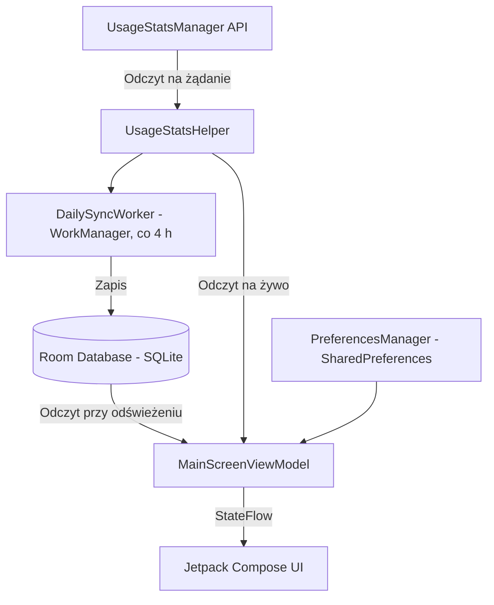

# ScrollDebt — Cyfrowe Lustro Twojego Czasu

**ScrollDebt** to minimalistyczna aplikacja na Androida, która pokazuje, ile czasu naprawdę tracisz
na bezmyślne przeglądanie mediów społecznościowych. Nie blokuje aplikacji i nie prawi kazań —
działa jak lustro.

Estetyka: czarny minimalizm w duchu Nothing OS z czerwonymi akcentami, z obsługą motywu jasnego
i ciemnego. Wszystkie dane pozostają na urządzeniu — aplikacja nie ma backendu ani analityki.

---

## 📱 Funkcje i faktyczna implementacja

### 1. Ekran „DZIŚ" (`TodayScreen.kt`)

Duży zegar z sumą dzisiejszego czasu, widget Dobrej Passy i lista top 5 aplikacji z paskami postępu.

- Odpytuje `UsageStatsManager` przez `UsageStatsHelper.kt`, licząc zdarzenia `ACTIVITY_RESUMED` /
  `ACTIVITY_PAUSED` od lokalnej północy.
- Filtruje wyniki po pakietach wybranych w Ustawieniach.
- **Dobra Passa** to liczba kolejnych dni (licząc wstecz od dzisiaj), w których suma nie przekroczyła
  progu passy. Dni bez rekordu w bazie traktowane są jako „poniżej progu", ale cofamy się tylko do
  najstarszego posiadanego rekordu — świeża instalacja nie może odziedziczyć passy z przeszłości.
- Paski są proporcjonalne do aplikacji o najwyższym czasie i animowane (`animateFloatAsState`)
  **przy zmianie wartości**. Nie ma animacji „od 0%" przy wejściu na ekran.

### 2. Komunikaty „Brutalna Prawda" (`BrutalTruthEngine.kt`)

- Pula: **45 komunikatów ogólnych** (3 przedziały × 15) i **27 komunikatów przypisanych do konkretnych
  aplikacji** na każdy język. Przy 5 językach daje to **360 tekstów**. Wszystkie 5 języków mają
  komplet — nie ma luk tłumaczeniowych.
- Przedziały czasowe: krótki (<30 min), średni (<120 min), długi (≥120 min).
- Jeśli istnieje aplikacja z czasem >10 min, z prawdopodobieństwem 40% komunikat jest dobierany
  spośród dedykowanych dla niej.
- **Bez powtórzeń w obrębie sesji:** zbiór `seenQuotes` gwarantuje wyczerpanie puli przed powtórką.
  Zbiór jest trzymany **wyłącznie w pamięci** i zeruje się po ubiciu procesu — to celowy kompromis,
  żeby nie zapisywać kilkuset stringów na dysk przy każdym roaście.
- Wyłączenie komunikatów w Ustawieniach ukrywa cały baner animacją `AnimatedVisibility`.

### 3. Ekran „STRACONE" (`LifeLostScreen.kt`)

Przelicza skumulowany czas na życiowe alternatywy i generuje grafikę do udostępnienia.

- Sumuje historię z Room DB z dzisiejszym czasem.
- Rysuje wykres tygodniowy (7 ostatnich dni kalendarzowych) oraz sekcję **Przepalone pieniądze**
  (stawka godzinowa zależna od wybranego języka).
- **Share My Shame:** natywne `Canvas` generuje obraz **1080×1920** (format relacji IG/TikTok)
  udostępniany przez `FileProvider` (konfiguracja w `res/xml/file_paths.xml`). Grafika zawiera
  rangę i roast tygodniowy — **nie** zawiera wykresu.
- **Rangi:** 5 progów (Rookie, Scroll Junkie, Digital Zombie, No Life, Brain Dead), do każdej
  losowany jest 1 z 5 wariantów tekstowych, w 5 językach — łącznie **125 wariantów**.
- Przeliczniki (na podstawie sumy godzin): dni `/24`, cykle snu `/1.5`, treningi `/1.5`,
  książki `/4`, maratony `/4.5`, filmy `/2`, nowe umiejętności `/100`.

### 4. Ekran „USTAWIENIA" (`SettingsScreen.kt`)

- **Śledzone aplikacje:** skanowanie zainstalowanych aplikacji przez tag `<queries>` z filtrem
  `MAIN`/`LAUNCHER` (zgodne z polityką Play — bez `QUERY_ALL_PACKAGES`). Dowolną aplikację można
  dodać z dolnego panelu (`ModalBottomSheet`).
- **Motyw jasny / ciemny** — przebudowuje kolory przez `MaterialTheme.colorScheme`; paski systemowe
  podążają za wyborem.
- **Hybrydowy system powiadomień:**
  - *Tryb Snajperski* — `Foreground Service` budzący się co 60 s; wymaga stałej ikony.
  - *Tryb Oszczędny* — `WorkManager` z interwałem 15 min (minimum narzucone przez system).
  - Tryby wykluczają się wzajemnie; włączenie jednego wyłącza drugi (`TrackingScheduler.kt`).
- **Próg powiadomień** i **próg Dobrej Passy** — dwa niezależne suwaki, zakres **15–300 minut**.

> **Uwaga:** przełącznik języka **nie** znajduje się na ekranie Ustawień. Jest to menu pod ikoną
> globusa na górnym pasku, dostępne z każdego ekranu.

### 5. Przełącznik języka (EN / ES / FR / DE / PL)

Menu globusa na górnym pasku. Zmiana języka zapisuje preferencję i wywołuje `recreate()` Activity —
`MainActivity.attachBaseContext` podmienia `Context` na zlokalizowany (`LocaleUtils.kt`), dzięki
czemu tłumaczy się **cały** interfejs, a nie tylko treści dynamiczne. ViewModel przeżywa
przeładowanie, więc dane nie są ładowane ponownie.

### 6. Ekran powitalny (`OnboardingScreen.kt`)

- Wyjaśnia zasadę działania i zawiera wymaganą przez Google Play informację o zbieraniu danych
  użycia (checkbox zgody odblokowuje przycisk).
- Przycisk otwiera `Settings.ACTION_USAGE_ACCESS_SETTINGS`.
- Po powrocie aplikacja wykrywa uprawnienie w `ON_RESUME` i przechodzi dalej.

---

## 🛠️ Architektura i przepływ danych



`DailySyncWorker` działa **co 4 godziny**, z opóźnieniem pierwszego uruchomienia o 15 minut.
ViewModel **nie obserwuje** bazy reaktywnie — odczytuje ją przy odświeżeniu ekranu (`ON_RESUME`)
oraz po zmianach ustawień.

### Stack technologiczny

| Warstwa | Rozwiązanie |
|---|---|
| Język | Kotlin |
| UI | Jetpack Compose (Material 3, motyw własny) |
| DI | Hilt |
| Baza | Room (SQLite), tabela `UsageRecord`, klucz `date` w formacie ISO `YYYY-MM-DD` |
| Zadania w tle | WorkManager (`DailySyncWorker`, `ThresholdWorker`) + `DoomTrackerService` |
| Widget | Glance |
| Stan | `StateFlow` + `ViewModel` |
| Nawigacja | przełączanie widoków przez `when (selectedTab)` w `MainScreen` |

Projekt **nie używa** Jetpack Compose Navigation — ani jako zależności, ani w kodzie.

---

## 🚀 Budowanie

Wymagania: **Android Studio** oraz **JDK 17+** (`jvmToolchain(17)`), `compileSdk`/`targetSdk` 36,
`minSdk` 24 (Android 7.0).

```bash
./gradlew assembleDebug
```

### Build release (podpisany)

Podpisywanie czyta `keystore.properties` z katalogu głównego projektu. Plik ten oraz `.jks`
są w `.gitignore` i **nigdy** nie trafiają do repozytorium:

```properties
storeFile=release-key.jks
storePassword=...
keyAlias=scrolldebt
keyPassword=...
```

```bash
./gradlew assembleRelease
```

Bez `keystore.properties` build release nadal przechodzi, ale produkuje APK niepodpisany —
dzięki temu świeży klon można zbudować i przetestować bez dostępu do klucza.

Weryfikacja podpisu:

```bash
apksigner verify --print-certs app/build/outputs/apk/release/app-release.apk
```

---

## ⚠️ Znane ograniczenia

- **Widget Glance** odświeża się co 30 minut (`updatePeriodMillis`) — to minimum narzucone przez
  system, więc czas na widżecie bywa nieaktualny. Widget nie jest odświeżany po zmianie danych
  w aplikacji.
- **Tryb Snajperski a bateria:** `Foreground Service` zużywa więcej energii. Nie wstaje też
  automatycznie po starcie systemu w tle na Androidzie 12+ — wraca przy pierwszym otwarciu aplikacji
  (Android zabrania startu usługi pierwszoplanowej z tła).
- **Tryb Oszczędny** może opóźnić powiadomienie o kilkanaście minut; w trybie Doze nawet dłużej.
- **Brak synchronizacji chmurowej.** Baza na urządzeniu to jedyna kopia historii — zmiana telefonu
  albo odinstalowanie aplikacji oznacza jej utratę.
- **Zmiana klucza podpisu:** wersje wcześniejsze niż 3.2.0 były rozprowadzane jako build *debug*.
  Aktualizacja „po wierzchu" nie zadziała — trzeba odinstalować starą wersję, co usuwa historię.
- Powiadomienie o przekroczeniu progu wysyłane jest **raz dziennie**.
