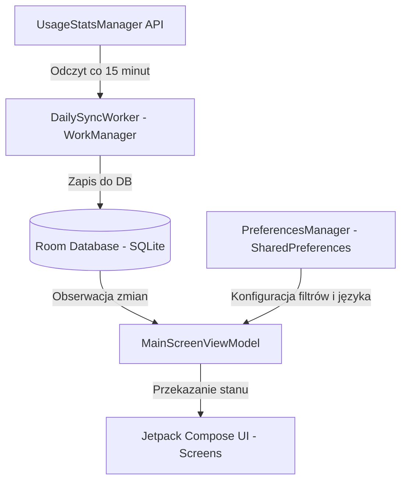

# ScrollDebt — Cyfrowe Lustro Twojego Czasu

**ScrollDebt** to minimalistyczna aplikacja na system Android zaprojektowana, aby pokazać Ci brutalną prawdę o czasie marnowanym na bezmyślne przeglądanie mediów społecznościowych (tzw. doomscrolling). Aplikacja nie blokuje dostępu, nie prawi kazań — działa jak psychologiczne lustro.

Aplikacja opiera się na estetyce czarnego minimalizmu Nothing OS z czerwonymi akcentami oraz wsparciem dla motywu Jasnego i Ciemnego.

---

## 📱 Funkcje Aplikacji i Zaimplementowana Logika

### 1. Ekran Główny — "DZIŚ" (`TodayScreen.kt`)
* **Co robi:** Pokazuje duży, cyfrowy zegar z sumą czasu zmarnowanego dziś, widget Dobrej Passy (Streak) oraz listę top 5 najbardziej uzależniających aplikacji z paskami postępu.
* **Jak działa pod spodem:**
  - Odpytuje systemowy `UsageStatsManager` za pośrednictwem klasy `UsageStatsHelper.kt` o statystyki użycia aplikacji od godziny 00:00 dnia dzisiejszego.
  - Filtruje wyniki na podstawie pakietów aplikacji zaznaczonych przez użytkownika w Ustawieniach.
  - Otrzymuje historyczne dane z `Room Database`, zliczając **Dobrą Passę (Streak)** — czyli ilość dni z rzędu bez przekraczania ustawionego progu czasowego.
  - Sortuje aplikacje malejąco według czasu i rysuje paski postępu (`LinearProgressIndicator`), gdzie długość paska jest proporcjonalna do aplikacji o najwyższym zużyciu czasu. Paski są **płynnie animowane** (`animateFloatAsState`) od 0% do stanu faktycznego przy otwieraniu ekranu.

### 2. Komunikaty "Brutalna Prawda" (`BrutalTruthEngine.kt`)
* **Co robi:** Wyświetla bezpośrednie, ironiczne i bolesne komentarze psychologiczne zamiast nudnych statystyk.
* **Jak działa pod spodem:**
  - Silnik analizuje strukturę Twojego dzisiejszego długu czasowego.
  - Posiada bazę **~200 zlokalizowanych komunikatów** podzielonych na kategorie czasowe: **krótkie** (<30 min), **średnie** (<120 min) oraz **długie** (>120 min).
  - Wykrywa tzw. *dominant app* (aplikację, na której spędziłeś jednorazowo >10 minut) i z prawdopodobieństwem 40% dobiera komunikat dedykowany specjalnie dla niej.
  - **Algorytm bez powtórzeń:** Silnik korzysta z pamięci stanu (zbiór `seenQuotes`), gwarantując, że nigdy nie zobaczysz tego samego cytatu, dopóki nie wyczerpiesz całej dostępnej puli.
  - Posiada pełne wsparcie dla wersji językowych: **polskiej (PL), angielskiej (EN), hiszpańskiej (ES), francuskiej (FR) oraz niemieckiej (DE)**.
  - **Dynamiczne znikanie:** Po wyłączeniu komunikatów w ustawieniach, cały baner **znika całkowicie** z ekranu głównego za pomocą płynnej animacji składania i zanikania (`AnimatedVisibility`), chroniąc czysty minimalistyczny interfejs i uniemożliwiając przypadkowe generowanie roastu.

### 3. Ekran "STRACONE" (`LifeLostScreen.kt`)
* **Co robi:** Przelicza skumulowany zmarnowany czas na namacalne, życiowe alternatywy oraz pozwala wygenerować **grafikę udostępniania (Share My Shame)**.
* **Jak działa pod spodem:**
  - Odczytuje dane historyczne z lokalnej bazy danych SQLite (Room DB) i sumuje je z dzisiejszym czasem.
  - Wykorzystuje natywne `Canvas`, by generować obraz 1080x1920 (dla relacji Instagram/TikTok) z tygodniowym rozkładem użycia.
  - **Dynamiczne rangi i roasty:** Silnik (`BrutalTruthEngine`) analizuje czas i przydziela jedną z **5 rang** (Rookie, Scroll Junkie, Digital Zombie, No Life, Brain Dead). Do rangi losowany jest jeden z **75 wariantów tekstowych** (w 3 językach), co zapewnia pełną różnorodność grafik.
  - Udostępnia plik przez aplikacje zewnętrzne z użyciem `FileProvider`.
  - Dokonuje matematycznego przeliczenia całkowitej liczby godzin na:
    - **Stracone Dni:** Czyste 24-godzinne doby całkowicie wyjęte z życiorysu (`godziny / 24`).
    - **Cykle Snu:** Liczba zdrowych, pełnych 90-minutowych cykli regeneracyjnych, które mogłeś przespać (`godziny / 1.5`).
    - **Opuszczone Treningi:** Liczba pełnych, półtoragodzinnych sesji na siłowni, które przepadły (`godziny / 1.5`).
    - **Przeczytane Książki:** Liczba średnich 250-stronicowych książek, które mogłeś przeczytać (`godziny / 4`).
    - **Przebiegnięte Maratony:** Ilość maratonów pokonanych w średnim tempie (`godziny / 4.5`).
    - **Obejrzane Filmy:** Klasyki kina, które mogłeś nadrobić w tym czasie (`godziny / 2`).
    - **Nowe Umiejętności:** Biegłe opanowanie nowej pasji na poziomie średniozaawansowanym (`godziny / 100`).

### 4. Ekran "USTAWIENIA" (`SettingsScreen.kt`)
* **Co robi:** Pozwala na personalizację monitorowania, dynamiczną zmianę języka aplikacji, progi ostrzeżeń oraz powiadomienia.
* **Jak działa pod spodem:**
  - **Śledzone Aplikacje (Dynamiczne):** Zamiast sztywnej listy, aplikacja skanuje Twój telefon w poszukiwaniu zainstalowanych aplikacji (za pomocą bezpiecznego tagu `<queries>` w Manifest) i ukrywa te, których nie posiadasz. Pozwala również dobrać do śledzenia absolutnie **każdą** zainstalowaną grę czy komunikator z poziomu eleganckiego dolnego panelu (ModalBottomSheet). Każda pozycja to estetyczna karta. Zaznaczenie checkboxa aktualizuje listę śledzonych pakietów w preferencjach i natychmiastowo przelicza dzisiejsze statystyki.
  - **Przełącznik Języka (EN / ES / FR / DE / PL):** Segmentowy przełącznik na samej górze ekranu. Zmiana języka natychmiast przebudowuje interfejs w locie, w tym losuje nowy komunikat "Brutal Truth" w odpowiednim języku. Kolejność od najpopularniejszego na świecie.
  - **Motyw Jasny / Ciemny:** Możliwość błyskawicznej zmiany motywu aplikacji bezpośrednio z ustawień. Aplikacja natychmiastowo przebudowuje wszystkie kolory za pomocą dynamicznej palety `MaterialTheme.colorScheme`.
  - **Hybrydowy System Powiadomień (V2.0):** Potężna nowa architektura monitorowania czasu w tle pozwalająca na wybór między:
    - **Trybem Snajperskim:** Używa `Foreground Service` wybudzającego się co 60 sekund. Daje absolutną pewność powiadomienia na czas, ale wymaga stałej ikony na pasku powiadomień.
    - **Trybem Oszczędnym:** Wykorzystuje tradycyjny system `WorkManager`. Powiadomienia mogą mieć do kilkunastu minut opóźnienia, ale zyskujemy maksymalną oszczędność baterii i czysty pasek stanu.
  - **Powiadomienia Push i Ich Próg:** Suwak od 30 do 180 minut pozwalający precyzyjnie dobrać dzienny limit. Przekroczenie limitu wywoła natywne powiadomienie z bolesnym cytatem (widoczne tylko, gdy powiadomienia są włączone).
  - **Próg Dobrej Passy (Streak Threshold):** Oddzielny suwak pozwalający ustalić maksymalny czas spędzony w social mediach, którego nieprzekroczenie podtrzymuje Twoją dzienną passę na ekranie głównym.

### 5. Ekran Powitalny (`OnboardingScreen.kt`)
* **Co robi:** Wprowadza użytkownika w filozofię aplikacji i prosi o przyznanie wymaganego uprawnienia systemowego.
* **Jak działa pod spodem:**
  - Tłumaczy zasady działania aplikacji (brak chmury, 100% prywatności).
  - Udostępnia przycisk "PRZYZNAJ DOSTĘP", który otwiera intencję systemową ustawień systemu Android: `Settings.ACTION_USAGE_ACCESS_SETTINGS`.
  - Po powrocie z ustawień systemowych aplikacja automatycznie wykrywa przyznane uprawnienie (poprzez cykl życia `ON_RESUME`) i przenosi użytkownika do głównej części aplikacji.

---

## 🛠️ Architektura Techniczna i Przepływ Danych



### Stack Technologiczny
* **Język:** Kotlin (100% natywnie)
* **UI:** Jetpack Compose (z niestandardowym motywem minimalistycznym Nothing OS)
* **Baza Danych:** Room (SQLite) - przechowuje historię dób w tabeli `UsageRecord`
* **Zadania w Tle:** WorkManager (`DailySyncWorker.kt`) - wykonuje synchronizację danych co 4 godziny w tle
* **Stan:** StateFlow i ViewModel z natychmiastową reakcją na zmiany preferencji użytkownika
* **Nawigacja:** Stanowe przełączanie widoków w Compose (Today/Life Lost/Settings/Onboarding). Projekt jest przygotowany pod wdrożenie Jetpack Compose Navigation 3 (zależności zdefiniowane w `libs.versions.toml`).

---

## 🚀 Jak Uruchomić i Kompilować Projekt

1. Wymagane środowisko: **Android Studio Jellyfish+** oraz **JDK 17**.
2. Otwórz projekt w folderze `ScrollDebt`.
3. Aby zbudować i przetestować aplikację z poziomu terminala, użyj Gradle Wrapper:
   ```bash
   # Kompilacja kodu Kotlin
   .\gradlew compileDebugKotlin
   
   # Zbudowanie instalatora APK
   .\gradlew assembleDebug
   ```
4. Po zainstalowaniu na urządzeniu konieczne jest przyznanie uprawnienia **Dostęp do danych użycia** (aplikacja przekieruje Cię tam automatycznie przy pierwszym uruchomieniu).

---

## 📲 Instalacja APK na Telefonie

1. Zbuduj plik APK poleceniem `.\gradlew assembleDebug`.
2. Plik wynikowy znajdziesz w `ScrollDebt/app/build/outputs/apk/debug/app-debug.apk`.
3. Prześlij plik na telefon (np. kablem USB, ADB lub dyskiem w chmurze).
4. Na telefonie otwórz plik APK i zaakceptuj instalację z nieznanego źródła (Android może poprosić o zgodę).
5. Po uruchomieniu aplikacja poprosi o uprawnienie **Dostęp do danych użycia**.

---

## ⚠️ Znane Ograniczenia i Prace w Toku

- **Cykl odświeżania widżetu:** Android wymusza minimum 30 minut między aktualizacjami widżetu Glance, więc czas na widżecie może być nieaktualny.
- **Tryb Snajperski a bateria:** Foreground Service zużywa więcej baterii — użytkownik jest o tym informowany w ustawieniach.
- **Brak synchronizacji chmurowej:** Wszystkie dane są przechowywane wyłącznie lokalnie. Zmiana telefonu oznacza utratę historii.
